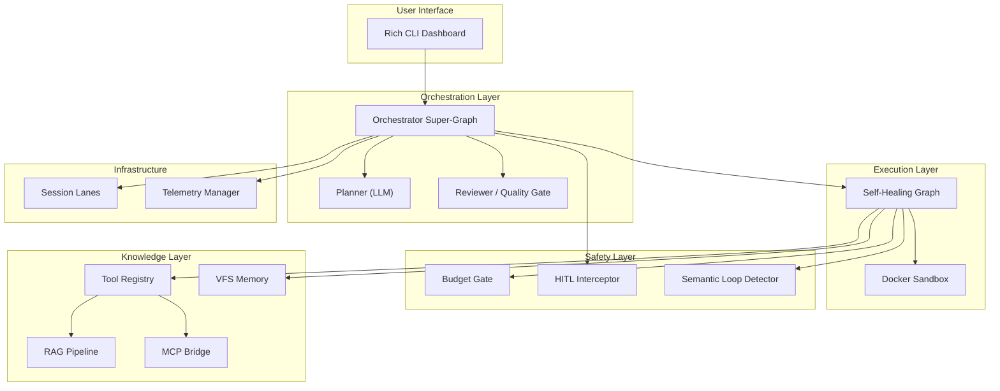

# Kappa Harness OS

**Autonomous Self-Healing Agent with Deterministic Guardrails**

Kappa is a production-grade AI agent harness that executes complex, multi-step goals autonomously — while enforcing strict safety boundaries at every layer. It decomposes high-level goals into subtask DAGs, executes code in isolated Docker sandboxes, self-heals on failure, and requires human approval for dangerous operations.

> *"The agent writes code. The harness decides whether it runs."*

---

## Architecture: The 9 Pillars

Kappa is built on nine interlocking pillars, each enforcing a specific safety or capability guarantee:



| # | Pillar | Module | Guarantee |
|---|--------|--------|-----------|
| 1 | **Budget Gate** | `budget/gate.py` | Circuit-breaker: no API call exceeds the token/cost ceiling |
| 2 | **Docker Sandbox** | `sandbox/executor.py` | All agent code runs in ephemeral, resource-limited containers |
| 3 | **Self-Healing Graph** | `graph/graph.py` | Parse → Execute → Diagnose → Fix loop with bounded retries |
| 4 | **Semantic Defense** | `defense/semantic.py` | Jaccard-based loop detection kills repetitive failure spirals |
| 5 | **Tool Registry** | `tools/registry.py` | Protocol-based plug-and-play tools with budget tracking |
| 6 | **VFS Memory** | `memory/vfs.py` | Path-safe persistent workspace (blocks traversal attacks) |
| 7 | **Orchestrator** | `graph/orchestrator.py` | Planner → Dispatcher → Reviewer DAG with parallel workers |
| 8 | **HITL Interceptor** | `hitl.py` | Policy-driven human approval for destructive/expensive ops |
| 9 | **Telemetry** | `telemetry/manager.py` | Thread-safe JSONL trajectory recording with think/critique/score |

**Phase 4 Extensions:**

| Extension | Module | Purpose |
|-----------|--------|---------|
| **MCP Bridge** | `tools/mcp.py` | Connect external MCP servers; auto-register tools |
| **RAG Pipeline** | `rag/manager.py` | Chunk → Embed → Store → Retrieve knowledge |
| **Rich CLI** | `cli.py` | Live dashboard with plan table, activity log, budget gauge |

---

## Quick Start

### Prerequisites

- **Python 3.11+**
- **Docker Desktop** (running)
- **Anthropic API Key**

### Installation

```bash
# Clone the repository
git clone https://github.com/your-org/kappa.git
cd kappa

# Install in development mode
pip install -e ".[dev]"

# Configure environment
cp .env.example .env
# Edit .env and set ANTHROPIC_API_KEY=sk-ant-...
```

### Run

```bash
# Single goal (non-interactive)
python -m kappa.main --goal "Write a Python function that solves FizzBuzz and test it"

# Interactive REPL
python -m kappa.main

# With overrides
python -m kappa.main --goal "..." --max-tokens 200000 --max-cost 10.0

# Auto-approve mode (skip HITL prompts)
python -m kappa.main --goal "..." --auto-approve

# Disable telemetry
python -m kappa.main --goal "..." --no-telemetry
```

### Run Tests

```bash
pytest                   # Run all 394 tests
pytest -x                # Stop on first failure
pytest tests/test_cli.py # Run specific test file
```

---

## How It Works

### 1. Goal Submission
The user provides a high-level goal via `--goal` or the interactive REPL.

### 2. Planning
The **Planner** (LLM) decomposes the goal into a DAG of subtasks with dependency ordering.

### 3. Dispatch
The **Dispatcher** identifies ready subtasks (all dependencies met) and runs them in parallel via `ThreadPoolExecutor`, each through a `SyncSessionLane` for resource safety.

### 4. Self-Healing Execution
Each subtask runs through a **SelfHealingGraph**:
- LLM generates code with `<think>` and `<code>` blocks
- Code executes in an isolated Docker container
- On failure: error diagnosis → code fix → re-execute (up to N retries)
- Semantic loop detector kills repetitive failures early

### 5. Quality Gate
The **Reviewer** (LLM) evaluates each result. Approved tasks proceed; rejected tasks loop back to the Dispatcher with critique for retry.

### 6. HITL Safety Net
The **HITLInterceptor** triggers human approval when:
- Budget drops below threshold (default: 20% remaining)
- Destructive keywords detected (rm, delete, drop, kill...)
- Task exceeds retry limit

### 7. Final Output
All approved results are merged into a unified output displayed in the Rich dashboard.

---

## Project Structure

```
src/kappa/
├── main.py                  # Production entrypoint (DI root)
├── cli.py                   # Rich CLI dashboard
├── hitl.py                  # Human-in-the-loop interceptor
├── config.py                # All configuration dataclasses
├── exceptions.py            # Custom exception hierarchy
├── budget/
│   ├── gate.py              # LLM provider + budget enforcement
│   └── tracker.py           # Thread-safe token/cost accounting
├── sandbox/
│   └── executor.py          # Docker container runtime
├── graph/
│   ├── graph.py             # Self-healing execution graph
│   ├── nodes.py             # LangGraph node implementations
│   └── orchestrator.py      # Multi-agent orchestrator super-graph
├── defense/
│   └── semantic.py          # Jaccard-based loop detection
├── tools/
│   ├── registry.py          # Protocol-based tool registry
│   └── mcp.py               # MCP server bridge + tool adapter
├── rag/
│   ├── manager.py           # Document chunking + vector retrieval
│   └── tool.py              # RAG-as-a-tool adapter
├── memory/
│   └── vfs.py               # Virtual file system (path-safe)
├── infra/
│   └── session_lane.py      # Per-key serialisation locks
└── telemetry/
    └── manager.py           # JSONL trajectory recorder

tests/
├── test_budget.py           # Budget gate + tracker tests
├── test_sandbox.py          # Docker sandbox tests
├── test_graph.py            # Self-healing graph tests
├── test_nodes.py            # Node implementation tests
├── test_defense.py          # Semantic loop detector tests
├── test_tools.py            # Tool registry tests
├── test_memory.py           # VFS manager tests
├── test_orchestrator.py     # Orchestrator super-graph tests
├── test_session_lane.py     # Session lane tests
├── test_telemetry.py        # Telemetry manager tests
├── test_hitl.py             # HITL interceptor tests
├── test_mcp.py              # MCP bridge tests
├── test_rag.py              # RAG pipeline tests
└── test_cli.py              # CLI dashboard tests
```

---

## Design Principles

- **Deterministic Guardrails** — The harness controls *if* and *how* agent code runs; the LLM never has unmediated system access.
- **Protocol-Based DI** — Every infrastructure component is defined by a Python `Protocol`; swap implementations without touching business logic.
- **OCP Compliance** — New tools, providers, and stores are added by implementing protocols and registering — zero modification to existing code.
- **Budget as Circuit Breaker** — Token and cost limits are enforced pre- and post-call with a permanent trip mechanism.
- **Defense in Depth** — Sandbox isolation + budget limits + semantic loop detection + HITL approval = four independent safety layers.

---

## Environment Variables

See [`.env.example`](.env.example) for the complete list with descriptions.

| Variable | Default | Description |
|----------|---------|-------------|
| `ANTHROPIC_API_KEY` | *(required)* | Anthropic API key |
| `LLM_MODEL` | `claude-sonnet-4-20250514` | Model for agents |
| `BUDGET_MAX_TOKENS` | `100000` | Session token ceiling |
| `BUDGET_MAX_COST_USD` | `5.00` | Session cost ceiling (USD) |
| `SANDBOX_TIMEOUT_SECONDS` | `30` | Container execution timeout |
| `SANDBOX_MEMORY_LIMIT_MB` | `256` | Container memory limit |
| `MAX_SELF_HEAL_RETRIES` | `3` | Self-healing retry limit |

---

## License

MIT
